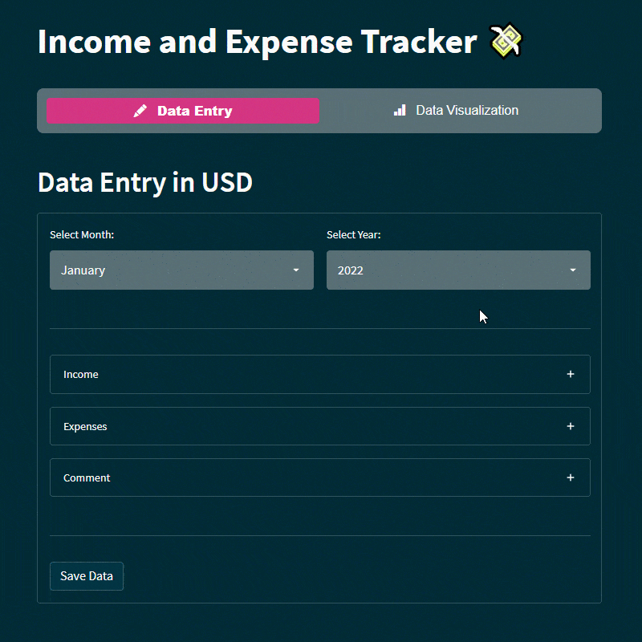

# Income-and-Expense-Tracker

Este aplicativo permite que os usuários registrem suas receitas e despesas mensais e, em seguida, visualize os dados em um gráfico de Sankey para entender melhor como seu dinheiro está sendo gasto.

## Requisitos
- Certifique-se de que você tenha os seguintes pacotes Python instalados em seu ambiente antes de executar o aplicativo:

    - calendar: Para obter nomes dos meses.
    - datetime: Para trabalhar com datas.
    - plotly: Para criar visualizações de dados interativas.
    - streamlit: Para criar a interface do usuário.
    - streamlit_option_menu: Para criar um menu de seleção de opções.
    - Além disso, você deve ter um módulo database contendo as funções para interagir com o banco de dados (não - - - - - fornecido no código, certifique-se de implementá-lo).

## Configuração
- Antes de iniciar o aplicativo, você pode configurar algumas opções:

        - incomes: Uma lista das fontes de receita, como salário, blogs, outras rendas.
        - expenses: Uma lista de categorias de despesas, como aluguel, utilidades, mantimentos, carro, outras despesas e economias.
        - currency: A moeda utilizada para as transações (por exemplo, USD).
        - page_title: O título da página do aplicativo.
        - page_icon: O ícone da página do aplicativo.
        - layout: O layout da página (por exemplo, "centered").

## Uso
- Para executar o aplicativo, basta rodar o arquivo Python. O aplicativo oferece duas principais funcionalidades:

        1. Data Entry: Permite que você insira dados de renda e despesas para um mês específico. Você pode selecionar o mês e o ano desejados, inserir valores de receita e despesa, e adicionar um comentário opcional. Os dados são salvos no banco de dados quando você pressiona o botão "Save Data".

        2. Data Visualization: Permite que você visualize os dados registrados em um gráfico de Sankey. Você pode selecionar um período específico para visualização. Os dados incluem informações sobre receita total, despesa total e orçamento restante.

## Estrutura do Código
- O código é organizado da seguinte forma:

        - Importações de pacotes e configuração inicial.
        - Definição de funções para obter todos os períodos registrados e para ocultar o estilo do Streamlit.
        - Criação de um menu de seleção para escolher entre "Data Entry" e "Data Visualization".
        - Manipulação da entrada de dados e salvamento no banco de dados no modo "Data Entry".
        - Visualização dos dados em um gráfico de Sankey no modo "Data Visualization".

## Banco de Dados
- Lembre-se de implementar o módulo database com as funções necessárias para interagir com o banco de dados. O aplicativo atualmente assume que existe um banco de dados para armazenar os dados de receita e despesa.

